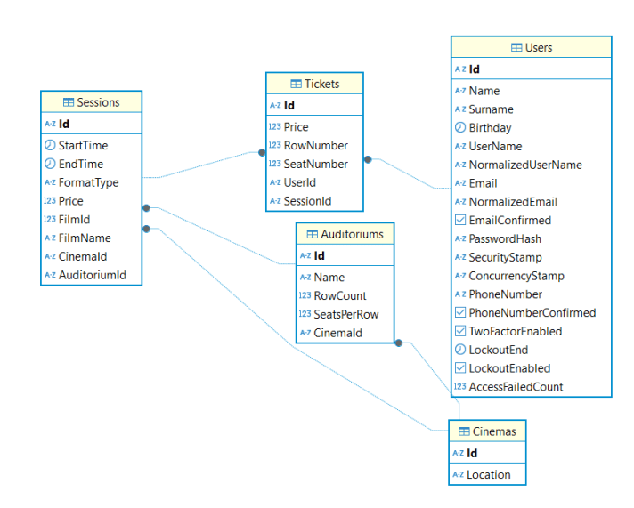
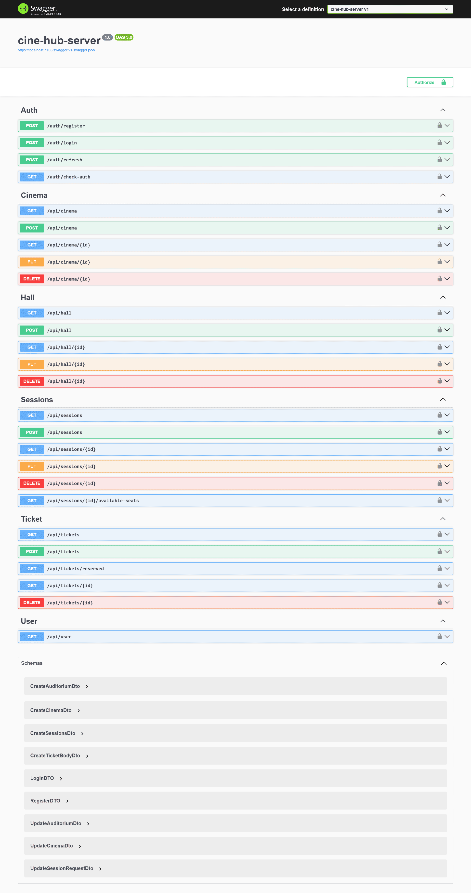

# CineHub Backend

## Table of Contents
- [Overview](#overview)
- [Technologies Used](#technologies-used)
- [Project Structure](#project-structure)
- [API Endpoints](#api-endpoints)
- [Pagination Format](#pagination-format)
- [Database Schema](#database-schema)
- [Swagger Documentation](#swagger-documentation)
- [Configuration](#configuration)
- [Admin Credentials](#admin-credentials)
- [Running the Project](#running-the-project)

## Overview
The CineHub backend is a web API built with ASP.NET Core that provides functionality for managing a cinema ticket booking system. It follows a three-tier architecture and interacts with a PostgreSQL database.

## Technologies Used
- **ASP.NET Core Web API**
- **PostgreSQL**
- **JWT Authentication**
- **Swagger for API documentation**
- **EF Core for database access**
- **Repository & Service Pattern**

## Project Structure
```
cine-hub-server/
├── Controllers/        # API controllers handling HTTP requests
├── Data_access/        # Database context, seed data, and migration management
│   ├── CineDbContext.cs  # Database context class for EF Core
│   ├── SeedData.cs       # Functions for populating the database with initial data
├── DTOs/              # Data Transfer Objects for request/response models
├── Exceptions/        # Custom exception handling classes
├── Helpers/           # Utility classes for various helper functions
├── Interfaces/        # Interface definitions for repositories and services
├── Migrations/        # Entity Framework migrations for database schema changes
├── Models/            # Entity models representing database tables
├── Repositories/      # Data access layer handling database operations
├── Services/          # Business logic layer containing application services
├── appsettings.json   # Application configuration file
├── Program.cs         # Main entry point of the application
```

## API Endpoints
### **AuthController**
Handles authentication and authorization.
- `POST /auth/login` - User login
- `POST /auth/register` - User registration
- `POST /auth/refresh` - Refresh JWT token
- `GET /auth/check-auth` - Check authentication status

### **UserController**
- `GET /user/` - Get user details

### **CinemaController**
Manages cinema entities.
- `GET /cinemas` - Get paginated list of cinemas
- `GET /cinemas/{id}` - Get cinema by ID
- `POST /cinemas` - Create a new cinema
- `PUT /cinemas/{id}` - Update cinema details
- `DELETE /cinemas/{id}` - Delete a cinema

### **HallController**
Manages cinema halls.
- `GET /halls` - Get paginated list of halls
- `GET /halls/{id}` - Get hall by ID
- `POST /halls` - Create a new hall
- `PUT /halls/{id}` - Update hall details
- `DELETE /halls/{id}` - Delete a hall

### **SessionsController**
Manages movie sessions.
- `GET /sessions` - Get paginated list of sessions
- `GET /sessions/{id}` - Get session by ID
- `POST /sessions` - Create a new session
- `PUT /sessions/{id}` - Update session details
- `DELETE /sessions/{id}` - Delete a session

### **TicketController**
Manages ticket bookings.
- `GET /tickets` - Get paginated list of tickets
- `GET /tickets/{id}` - Get ticket by ID
- `POST /tickets` - Book a ticket
- `DELETE /tickets/{id}` - Cancel a ticket

## Pagination Format
Each paginated API response includes:
```json
{
  "total_pages": 10,
  "total_results": 100,
  "page": 1,
  "results": []
}
```

## Database Schema



## Swagger Documentation



## Configuration
### **appsettings.json**
```json
{
  "Logging": {
    "LogLevel": {
      "Default": "Information",
      "Microsoft.AspNetCore": "Warning"
    }
  },
  "AllowedHosts": "*",
  "ConnectionStrings": {
    "WebApiDatabase": "Host=localhost; Database=CineHubDB; Username=<your_db_username>; Password=<your_db_password>"
  },
  "JwtOptions": {
    "Key": "<your_secret_key>",
    "AccessLifetime": 60,
    "RefreshLifetime": 10080,
    "Issuer": "<your_issuer>"
  },
  "AllowedOrigins": [
    "<your_frontend_domen>"
  ],
  "AdminCredentials": {
    "Password": "Admin@123"
  }
}
```

## Admin Credentials
Upon database initialization, an admin user is created:
- **Email:** `admin@example.com`
- **Password:** `Admin@123`

## Running the Project
1. Clone the repository
2. Set up PostgreSQL and configure the connection string in `appsettings.json`
3. Apply database migrations:
   ```sh
   dotnet ef database update
   ```
4. Run the project:
   ```sh
   dotnet run
   ```
5. Access the API documentation at `http://localhost:7108/swagger`
